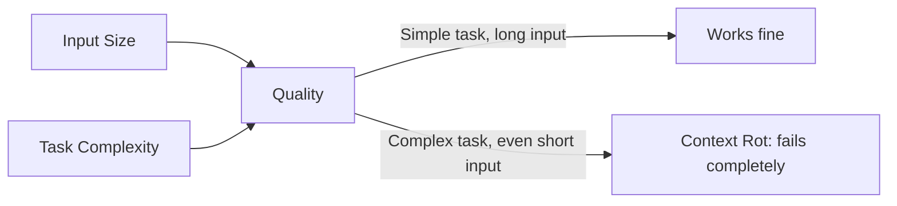
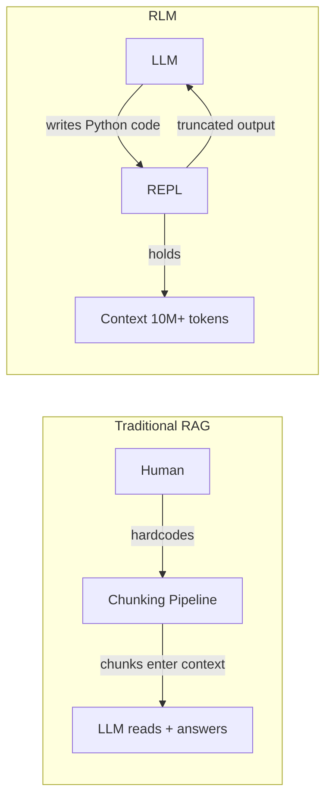
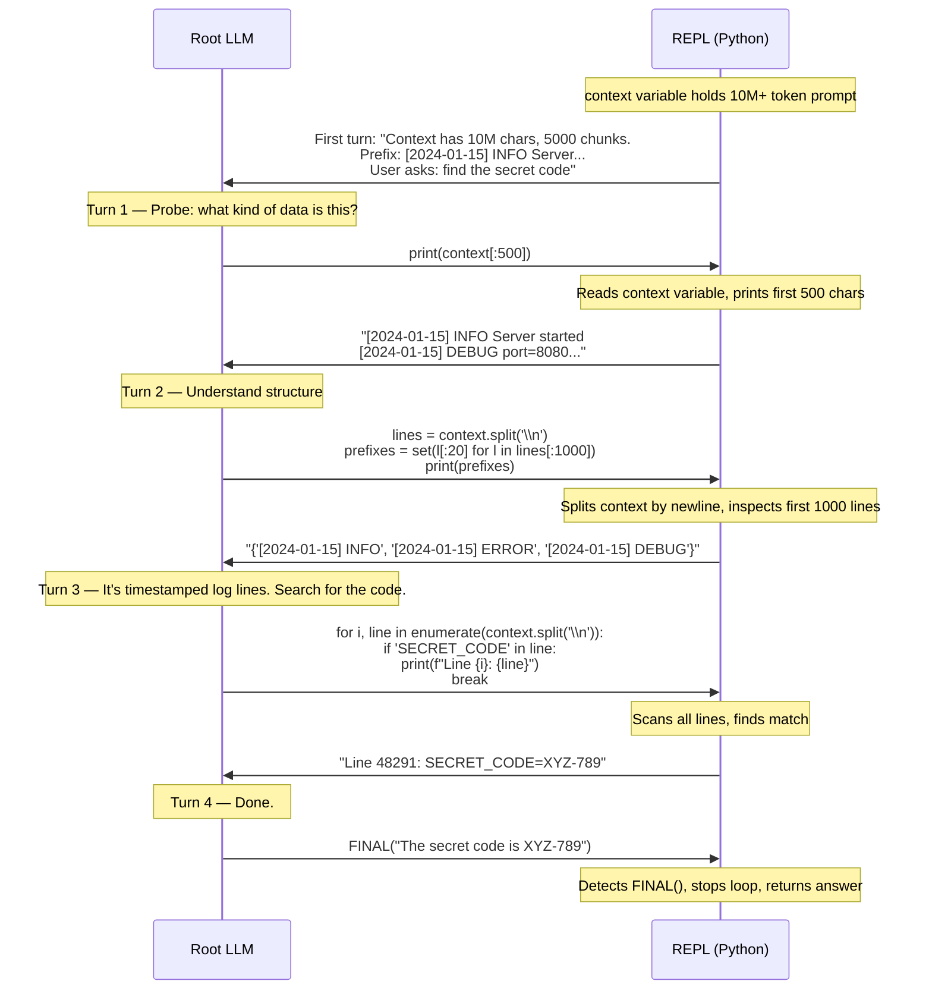
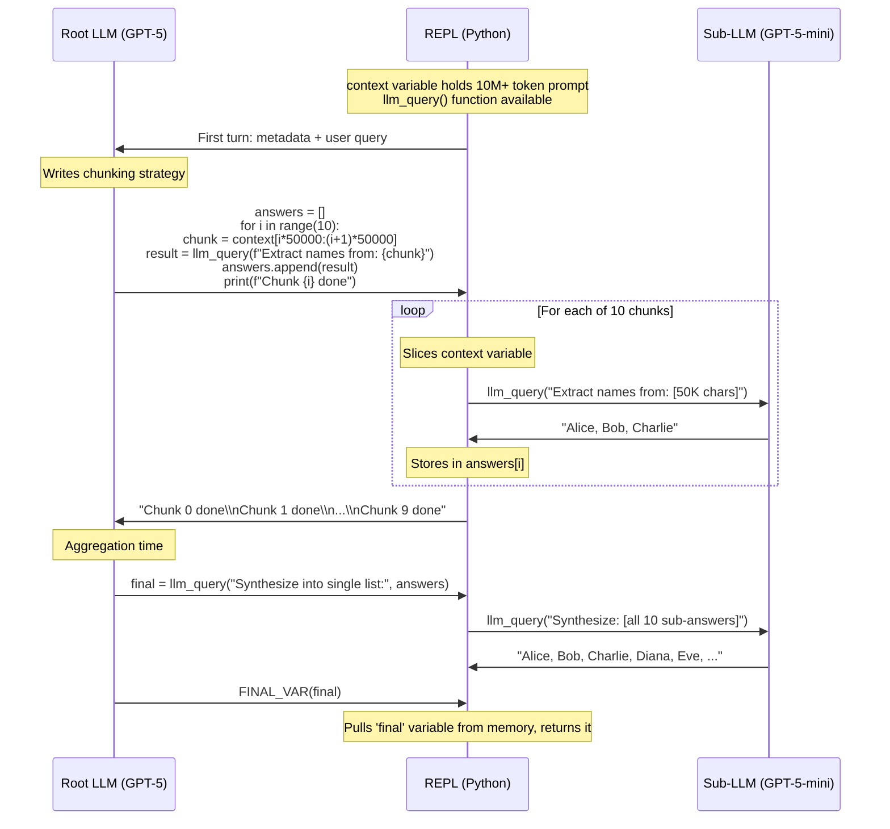

# RLMs — Learning Log

---

## OOLONG Data Appendix

### trec_coarse — Linear Task (O(n))

Data: 787 general-knowledge questions from TREC, each on one line:

```
Date: Jun 29, 2022 || User: 44436 || Instance: What does IOC stand for ?
Date: Apr 08, 2022 || User: 31080 || Instance: What do the letters D.C. stand for...
...
```

Each question has one of 6 labels: `location`, `numeric value`, `description and abstract concept`, `abbreviation`, `human being`, `entity`. Labels not in the text — must be inferred.

**Task**: "Which label is most common?"

**Complexity**: O(n). Classify each question (via sub-LLM), count labels, pick max. Work scales linearly — 787 questions = 787 classifications. RLM strategy: batch chunks of ~20-50 questions per sub-LLM call, aggregate in Python.

**Context size**: ~77K chars for full 787. Input fits in LLM context window but quality degrades (context rot).

---

### oolong-pairs — Quadratic Task (O(n²))

Same 787 labeled questions as input.

**Task**: "Find all pairs of questions that share the same topic but have conflicting answers."

**Complexity**: O(n²). Must compare every question against every other:

- n × (n − 1) / 2 pair comparisons
- 787 questions → ~309K unique pairs
- Each pair comparison = semantic check on topic overlap AND answer compatibility

Naive approach: classify each question (O(n)), then for each pair (O(n²)), ask sub-LLM "do Q_i and Q_j share topic but conflict?" = O(n²) sub-calls. 309K sub-calls — infeasible.

RLM approach: classify questions into coarse topics first (O(n)), then only compare within same topic bucket. If topics are balanced (~130 per bucket), intra-bucket pairs = 6 × (130 × 129 / 2) ≈ 50K comparisons. Still O(n²) but constant factor smaller.

**Why GPT-5 scores 0.1% F1**: 309K semantic pair judgments needed. Context window not the bottleneck (32K chars fits). Task complexity — each pair needs reasoning beyond what a single forward pass can do. RLM decomposes this into ~50K manageable sub-calls.

---

## 1 — The Problem



### Core Problem RLM Tries to Solve
- LLMs have fixed context windows (e.g., GPT-5: ~272K tokens)
- Real-world tasks need 10M+ tokens — orders of magnitude beyond any window
- Even within the window, quality degrades badly ("context rot")
- Question: can we process prompts 10x–100x bigger than the context window, without losing quality?

### What Is Context Rot?
- Not just "bigger input → worse output"
- It's "bigger input × complex task → worse output"
- A simple lookup task at 1M tokens can work fine
- A complex task at 32K tokens (well within window) can fail completely
- Task complexity per token matters as much as total token count
- Goldman et al. (2025), Hong et al. (2025) documented this

### OOLONG (The Benchmark)
- Named after oolong tea — not O(n²) notation, just a name
- Paper by Bertsch et al. (2025)
- OOLONG (trec_coarse split): linear complexity task
  - Dataset of questions with semantic labels
  - Task: label and aggregate every question
  - Work scales linearly with input length (touch each line once)
- OOLONG-Pairs: quadratic complexity task (paper's own variant)
  - Task: find pairs of questions with same topic but conflicting answers
  - Must compare every question against every other question
  - Work scales quadratically (~n²/2 comparisons)

### Where GPT-5 Fails
- OOLONG (linear, 131K tokens): scores 44% — decent
- OOLONG-Pairs (quadratic, 32K tokens): scores 0.1% F1 — functionally zero
- 32K << 272K window — window is NOT the bottleneck
- Task complexity killed it, not context overflow
- S-NIAH (simple needle lookup at even 1M tokens): works fine
  - Constant work regardless of input length (O(1))

### Context Window Limits
- GPT-5: ~272K tokens (the hard limit)
- Qwen3-8B: ~32K tokens
- The "effective" context window is often much smaller than the theoretical limit
- How much smaller depends on what task you're doing

### F1 Score
- Measures quality of list/structured answers vs gold answer
- 0% = completely wrong, 100% = perfect match
- GPT-5 scoring 0.1% on OOLONG-Pairs means it got essentially nothing right

---

## 2 — The Core Idea (Simplest Form)



### What Normal Chunking Does (RAG-style)
- Human decides: chunk size, chunk strategy, what question to ask per chunk
- Pipeline is hardcoded: split → query each chunk → aggregate
- Model has no control over the process

### What RLM Does Differently
- The LLM **writes the chunking code itself**, in real time
- The LLM decides: how to chunk, what to ask per chunk, when to stop, what to do with results
- The LLM can **adapt**: if one strategy fails, it writes different code next turn
- The prompt **never enters the LLM's context window** — it lives in a Python variable
- This enables LLMs to handle inputs way beyond their context window

### RLM vs RAG — 3 Key Differences
- **Who writes chunking logic:** RAG = human hardcodes pipeline. RLM = LLM writes its own Python code
- **Where prompt lives:** RAG = chunks go into LLM's context window. RLM = entire prompt lives as a Python variable, never enters context window
- **Fixed vs interactive:** RAG = one-shot pipeline. RLM = multi-turn loop where LLM probes → sees output → adapts → probes again

---

## 3 — The RLM Architecture (No Sub-LLMs Yet)



### One LLM, Two Modes
- There is only ONE LLM in the system
- It cycles between:
  - **Programmer mode:** writes Python code to inspect/process the context variable
  - **Decision mode:** reads truncated REPL output, decides next move or FINAL answer
- Same model, same identity, just different turns

### The REPL (Read-Eval-Print Loop)
- A standard Python interpreter running interactively
- Read: LLM generates Python code
- Eval: Python executes that code
- Print: Python prints output (truncated)
- Loop: truncated output sent back to LLM for next turn

### The Context Variable
- Entire user prompt (even 10M+ tokens) stored as a Python variable in REPL memory
- Named `context` — accessible via standard Python string operations
- LLM never reads it directly — only writes code to manipulate it

### What the LLM Actually Sees Each Turn
- Short metadata about the context (length, chunk count, a prefix)
- Code it wrote in previous turns
- Truncated output from previous code executions
- That's it. Not the full context. Not the full sub-results.

### Termination
- LLM signals completion with FINAL("answer string") or FINAL_VAR(variable_name)
- FINAL("...") = return this string directly
- FINAL_VAR(x) = pull variable x from REPL memory and return its value
- Before FINAL, the loop keeps going indefinitely

---

## 4 — Sub-LLMs (The Full Picture)



### Roles
- **Root LLM** = the brain. Writes all Python code. Decides strategy. Never reads context directly.
- **Sub-LLM** = a reading tool. Receives text chunk + question → returns analysis. Dumb worker.
- **REPL** = orchestrator. Executes root LLM's code. Manages context variable and sub-results.
- **llm_query()** = the bridge. A Python function inside the REPL that calls the sub-LLM API.

### What Happens in One Turn
1. Root LLM sees truncated history from last turn
2. Root LLM writes Python code with a strategy (chunk loop, filter, etc.)
3. REPL executes code → slices context → calls llm_query() many times
4. Each llm_query() = separate API call to sub-LLM
5. Sub-answers accumulate in Python variables (buffers)
6. REPL prints truncated summary → feeds back to root LLM
7. Root LLM decides: keep probing, or FINAL?

### Why Sub-LLMs Are Necessary
- Root LLM cannot read the context variable directly
- It needs workers (sub-LLMs) to do the actual reading and comprehension
- Sub-LLMs are typically cheaper/faster (GPT-5-mini vs GPT-5)
- Root LLM controls what each sub-LLM reads and what question it answers

### Recursion (Depth > 1)
- `rlm_query()` instead of `llm_query()` spawns a full nested RLM loop
- Sub-RLM gets its own REPL, own context variable, own sub-sub-calls
- Enables recursive decomposition of complex problems
- If max recursion depth reached, falls back to plain `llm_query()`

---

## Next: To Cover (Tomorrow)

### 1. Key Design Principles (Algorithm 2 — what NOT to do)
- Principle 1: Prompt must never enter the LLM's context window
- Principle 2: Output must be unbounded (build via REPL variables, not direct LLM output)
- Principle 3: Recursion must be symbolic (Python `for` loops), not verbal ("I delegate task X")
- These are the three "flaws" that separate RLM from naive agent scaffolds

### 2. Why RLM Beats Baselines
- Full Table 1 results walkthrough
- Baselines: Compaction agent, CodeAct + BM25, CodeAct + sub-calls, OpenCode, Claude Code
- The 6 observations from the results section
- Where each baseline fails and why RLM doesn't
- Potential for live demo

### 3. Fine-Tuning Recipe
- Why they trained: small models (Qwen3-8B) can't code well enough for RLM scaffold alone
- What they did: 1000 filtered trajectories from Qwen3-Coder-480B, distilled to Qwen3-8B
- Key insight: train the root LLM to write better code, not the sub-calls
- Result: 28.3% median gain across all 4 benchmarks, 3x faster, lower API costs
- Training cost: 48 H100 hours, batch size 64, 300 steps
- Programmatic fix step: 16% of turns had FINAL misuse, 13% had variable naming errors

---

## Cost Warning

### Infinite Search Is a Real Failure Mode
- If root LLM doesn't find what it's looking for, it can keep probing through context forever
- Each turn spawns more sub-LLM calls → API costs compound
- Root LLM's own context window limits max turns (~10-15 before its window fills)
- Explicit max iterations used in training (20) but not a perfect fix

### Paper's Own Data Shows This
- Median RLM run: CHEAPER than base model
- Average RLM run: MORE expensive than base model
- Outlier trajectories where RLM spirals drag up the average
- Exploding sub-call costs listed as unsolved limitation

### Guardrails (Partial)
- Root LLM context window naturally caps turn count (each turn adds code + output)
- Explicit max iteration cap (configurable)
- Cost tracking / budget limits (not in paper, but practical necessity)
- None of these are foolproof — this is open research
